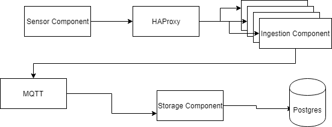

# genscape_test
Implementation of Genscape tech test

## Requirements
In order to get this running you have to install both docker and docker-compose. See documents if you don't have it installed now: https://docs.docker.com/compose/install/

After succesfull installation of docker, you have to execute script `build.sh`, which will build necessary docker images (if you are running on Windows you have to rename docker to docker.exe in build script):


```./build.sh```

Once images are built, you have to create `.env` file from teplate. Template contains default values for postgres, but it can contain other variables as well (in case of future developemnt and addition of extra servires):


```cp env_template .env```

## Starting of system

These are only required steps to get this tech demo working. To start you have to execute following command (if you are running on Windows you have to change docker-compose to docker-compose.exe):


```docker-compose up```

## Design of system



### Sensor component
Sensor component sends data every 10 seconds to ingestion component. It picks unique uuid every time new docker container starts.

### Ingestion component
Ingestion component is simple flask app, which receives data from sensor component, enriches it with temperature in celsius and forwards this data to MQTT queue.

### Storage component
Storage component takes messages from queue and stores it into PostgreSQL database.

## Scaling of system
HAProxy https://www.haproxy.org is part of system and it's used for load balancing sensor message, which are comming to ingestion component. Number of replicas of Ingestion component can be changed this way (after system was started with docker-compose up):

```docker-compose scale scale ingestion=10```

In order to test this properly, we have to increase number of sensor containers running, which can be done in similar way:
```docker-compose scale scale sensor=10```

HAProxy will loadbalance these requests across freshly created ingestion components.
